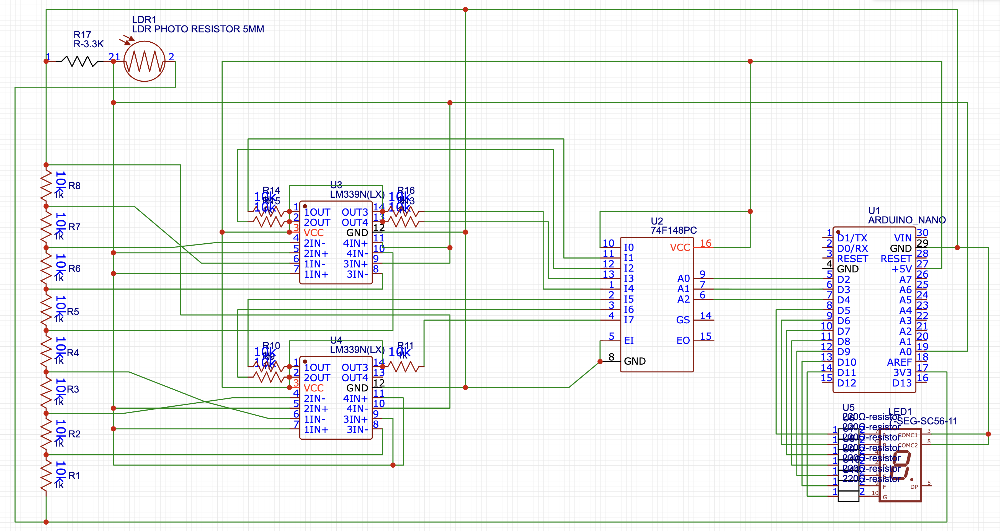
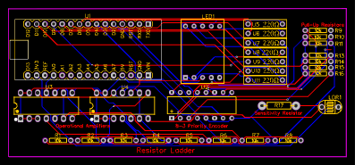
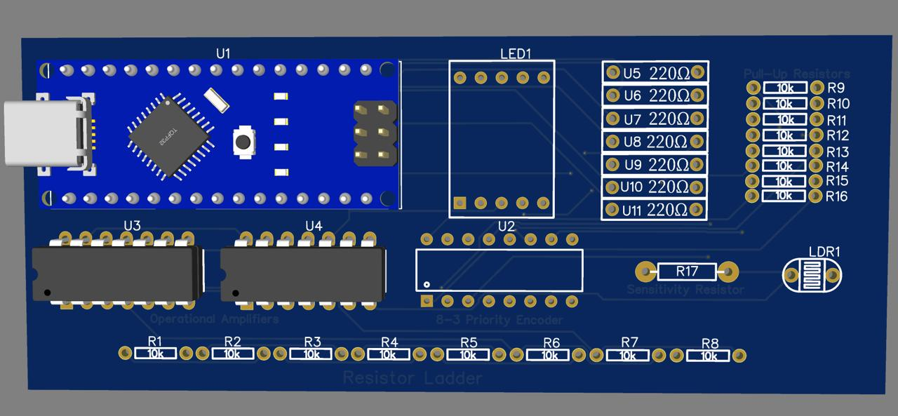
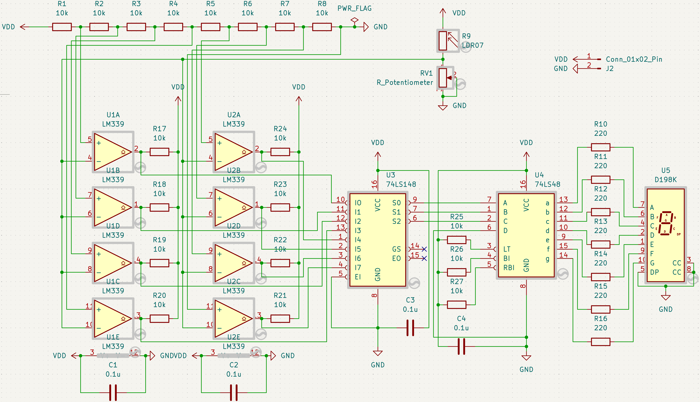
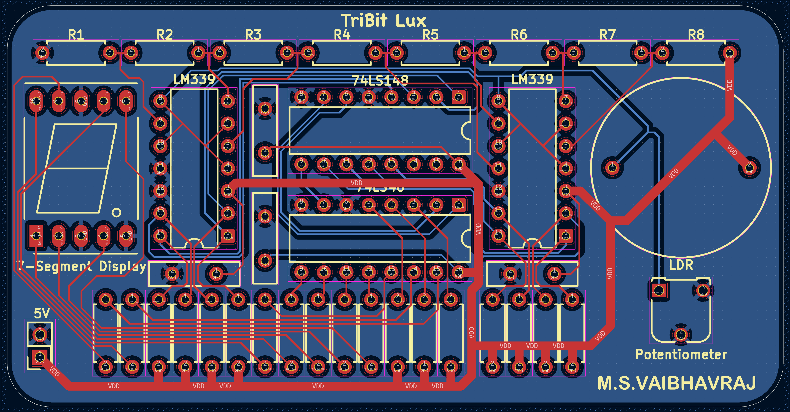

# ☀️ TriBit Lux

### From an LDR experiment to a real hardware PCB.

**TriBit Lux** is a 3-bit flash ADC–style brightness indicator that converts ambient light into a digital level and displays it on a seven-segment display.

The interesting part isn't just the final circuit.

It is the **evolution of the circuit**:

> **What started as Arduino-controlled logic gradually became hardware-controlled logic, then a breadboard prototype, and finally a PCB.**

```text
        LIGHT
          ↓
        LDR
          ↓
     Analog Voltage
          ↓
   LM339 Comparators
          ↓
    Comparator Levels
          ↓
      74F148
   Priority Encoder
          ↓
       3-bit Code
          ↓
       74LS48
   Display Decoder
          ↓
     7-Segment
```

---

## 🧭 The Journey

```text
🧪 V0.0
TinkerCAD + Arduino
     ↓
🌤️ V0.1
Real LDR + Comparators
     ↓
🔌 V1.0
First Breadboard
     ↓
🧠 V1.1
Hardware Priority Encoder
     ↓
🔢 V1.2
Hardware 7-Segment Decoder
     ↓
📟 V1.3
LCD Monitoring
     ↓
🟢 V2.0
KiCad PCB
     ↓
🚧 V2.1
Fabricated Hardware
```

Every version was built to answer a different question.

---

# 🧪 V0.0 — Can the idea work?

### TinkerCAD simulation

The first goal wasn't to make a sophisticated ADC.

It was simply to prove the basic idea:

> **Can a changing analog voltage be converted into a small number of brightness levels and represented digitally?**

Since using a real LDR inside the simulation wasn't the starting point, a **potentiometer** was used to imitate the changing sensor voltage.

The Arduino handled the interpretation and seven-segment display control in software.

### Circuit idea

```text
Potentiometer
      │
      ▼
Comparator Bank
      │
      ▼
Arduino
      │
      ▼
7-Segment Display
```

### 🖼️ Simulation


**What this version proved:** the overall concept was workable.

**What it didn't prove:** whether the system would behave like a real light sensor.

**So the next question became:**  
> What happens when the potentiometer is replaced by actual light?

### 🔗 Files

[TinkerCAD simulation](https://www.tinkercad.com/things/60Tk7pVbgVW-tribit-lux-v00?sharecode=bsW5T545n6U2o7TxL7Ta_quI-Dl-KoERqczIX1Q8Fq4) · [Schematic](Version_0.0/Tribit%20Lux%20V0.0.pdf) · [Arduino sketch](Version_0.0/tribit_lux_v0_00.ino) · [BOM](Version_0.0/bom.csv)

---

# 🌤️ V0.1 — Can real light drive the circuit?

### LDR + LM339

The potentiometer had done its job.

Now it was time to replace the artificial voltage source with the actual thing TriBit Lux was supposed to measure:

**light.**

An **LDR** was introduced together with **LM339 comparators**.

The analog part of the system was now starting to resemble the intended hardware architecture.

```text
             LIGHT
               ↓
              LDR
               ↓
        Voltage Divider
               ↓
        ┌──────────────┐
        │   LM339 × 2  │
        │  Comparators │
        └──────┬───────┘
               ↓
        Digital Levels
               ↓
            Arduino
```


The Arduino was still doing the **priority encoding and display logic**, but the important change was that the input was now responding to the real physical quantity of interest.

**Design realization:** the circuit was no longer just a software experiment. The analog front-end itself was becoming real hardware.

### 🔗 Files

[TinkerCAD simulation](https://www.tinkercad.com/things/gNVAR2cQYVG-tribit-lux-v01?sharecode=9jLX_zzwRAG0_mHYH1R4YNfyqPdioSTKhPsh0a257ho) · [Schematic](Version_0.1/Tribit%20Lux%20V0.1.pdf) · [Arduino sketch](Version_0.1/tribit_lux_v0_01.ino) · [BOM](Version_0.1/bom.csv)

---

# 🔌 V1.0 — What happens when the simulator becomes a breadboard?

### First physical prototype

At this point, simulation had answered enough questions.

The next step was simple:

> **Build it.**

The LDR and two LM339s were moved onto a physical breadboard, and an **Arduino Nano** was used to read the comparator outputs and control the display.


The important lesson here was that simulation and physical electronics are not quite the same thing.

Now the project had to deal with:

- actual component tolerances
- real wiring
- power connections
- sensor behaviour
- breadboard parasitics
- physical display pin arrangements

The Arduino still performed most of the digital decision-making.

That raised the next engineering question:

> **Why should a microcontroller perform a job that a digital logic IC can perform directly?**

### 🔗 Files

[Breadboard video](Version_1.0/TriBitLux_V1_0%202026-10-06%20at%2023.10.18.mp4) · [7-segment pin visualizer](Version_1.0/TriBitLux_V1_0_pin_visualizer.html) · [Serial visualizer sketch](Version_1.0/TriBitLux_V1_0_visualizer.ino)

> The visualizer sketch is a learning/debugging aid, not the complete V1.0 firmware.

---

# 🧠 V1.1 — Can the hardware make the decision?

### Introducing the 74F148

This was the first major step toward the original hardware-design idea.

Instead of asking the Arduino:

> "Which comparator is active?"

the circuit now contains a dedicated **74F148 priority encoder**.

```text
LM339 Comparator Bank
          │
          ▼
     Thermometer
        Code
          │
          ▼
       74F148
   Priority Encoder
          │
          ▼
       3-bit
       Output
          │
          ▼
       Arduino
```





### Why this mattered

The Arduino wasn't removed.

Instead, its role was deliberately reduced.

The goal was to understand the boundary between **analog hardware, digital logic and software**.

The 74F148 now handled the priority encoding, while the Nano simply observed the result.

### Physical prototype



This version marked the transition from:

**"Arduino reads the circuit"**

to

**"The circuit itself produces a meaningful digital result."**

### 🔗 Files

[Schematic](Version_1.1/Schematic_TriBitLux_V1_1-LIC_2026-10-06.pdf) · [PCB](Version_1.1/PCB_PCB_TriBitLux_V1_1-LIC_2_2026-10-06.pdf) · [BOM](Version_1.1/BOM_TriBitLux_V1_1-LIC_2026-10-06.csv) · [Gerbers](Version_1.1/Gerber_TriBitLux_V1_1-LIC_PCB_TriBitLux_V1_1-LIC_2_2026-10-06.zip)

---

# 🔢 V1.2 — Can the display become hardware too?

### Introducing the 74LS48

The next dependency on the Arduino was even more obvious.

The encoder already produced a digital code.

So why should the Nano turn that code into seven-segment signals?

It shouldn't.

The **74LS48** was added to perform the display decoding directly in hardware.

```text
LM339
 │
 ▼
74F148
 │
 │ 3-bit code
 ▼
74LS48
 │
 ▼
7-Segment
```

### Physical build


Now the complete display path was handled by dedicated hardware.

The Arduino's job became much smaller:

> **Observe the binary output and print it to the serial monitor for verification.**

This was an important milestone because the seven-segment display was now **physically driven by logic ICs rather than Arduino display code**.

### 🔗 Files

[Nano serial-monitor sketch](Version_1.2/TriBitLux_V1_2_LIC.ino) · [Video](Version_1.2/TriBitLux_V1_2_0732.mov)

> The sketch also contains seven-segment output code for experimentation, but that is **not** the display path used in the photographed V1.2 build.

---

# 📟 V1.3 — What if the circuit could tell us more?

### Adding an LCD

The seven-segment display tells us the **level**.

But during development, another question became useful:

> **What is the sensor voltage actually doing?**

So a **16×2 I²C LCD** was added.


This version wasn't intended to replace the hardware logic.

Instead, it became a **development and monitoring stage**.

The Nano reads the LDR voltage through its analog input and calculates the displayed level in software.

```text
             LDR
              │
              ├──────────► LM339 → 74F148 → 74LS48 → 7-Segment
              │
              ▼
          Arduino ADC
              │
              ▼
             LCD
```

This is important because **V1.3's LCD firmware does not read the 74F148 outputs**.

It independently measures the LDR voltage and calculates the level.

That made the LCD useful for understanding what was happening inside the analog section while the hardware seven-segment path continued doing its own job.

### 🔗 Files

[Photo 1](Version_1.3/TriBitLux_V1_3%20%281%29.jpg) · [Photo 2](Version_1.3/TriBitLux_V1_3%20%282%29.jpg) · [LCD visualization](Version_1.3/TriBitLux_V1_3.html) · [LCD sketch](Version_1.3/TriBitLux_V1_3.ino)

---

# 🟢 V2.0 — Can the whole thing become a proper board?

### From jumper wires to copper traces.

By now the architecture had been tested through multiple physical iterations.

The next problem was no longer:

> "Does the circuit work?"

It was:

> **"Can I package the circuit into something compact, repeatable and manufacturable?"**

That became **V2.0**.

The circuit was recreated in **KiCad** as an editable schematic and PCB layout.





.png)

### What changed?

**☀️ 20 mm LDR opening**

The sensor opening was enlarged to make physical placement and light exposure more practical.

**🎚️ Adjustable sensitivity**

A potentiometer was introduced so the response of the brightness indicator can be adjusted rather than being completely fixed.

**🛡️ 0.1 µF decoupling**

Local bypass capacitors were added around the IC supply rails to improve supply stability and reduce unwanted noise.

**🧱 Through-hole construction**

The board remains intentionally friendly to manual assembly, inspection and modification.

---

# 🧩 V2.0 Hardware Architecture

```text
                       ☀️ LIGHT
                          │
                          ▼
                    ┌───────────┐
                    │    LDR    │
                    └─────┬─────┘
                          │
                    Sensor Voltage
                          │
                          ▼
               ┌────────────────────┐
               │      LM339 × 2     │
               │  Comparator Bank   │
               └─────────┬──────────┘
                         │
                   7 comparator
                     decisions
                         │
                         ▼
                 ┌──────────────┐
                 │    74F148    │
                 │   Priority   │
                 │    Encoder   │
                 └───────┬──────┘
                         │
                       3 bits
                    ┌────┴────┐
                    ▼         ▼
               Debug/Test   74LS48
                               │
                               ▼
                           7-Segment
                            Display
```

The important architectural change is that the **core signal path no longer depends on the Arduino**.

---

# 🏗️ Inside V2.0

The editable project is kept here:

```text
Version_2.0/
└── TriBitLux_V2_0/
    ├── TriBitLux_V2_0.kicad_pro
    ├── TriBitLux_V2_0.kicad_sch
    └── TriBitLux_V2_0.kicad_pcb
```

Manufacturing-related files are kept separately:

```text
Version_2.0/
├── Gerber/
└── JLCPCB/
    ├── TriBitLux_V2_0_JLCPCB_BOM.csv
    └── TriBitLux_V2_0_JLCPCB_CPL.csv
```

### Current status

**PCB design complete. Fabrication pending.**

```text
Schematic
    ✅
     ↓
PCB Layout
    ✅
     ↓
Gerber Generation
    ✅
     ↓
Manufacturing
    ⏳
     ↓
Assembly
    ⏳
     ↓
Power-up
    ⏳
     ↓
Real-world validation
    ⏳
```

---

# 📈 The Engineering Progression

The versions are not just revisions of the same circuit.

Each one removed uncertainty.

| Version | Question being answered |
|:---:|---|
| **V0.0** | Can the basic concept work? |
| **V0.1** | Can actual light be converted into useful comparator states? |
| **V1.0** | Does the circuit survive physical implementation? |
| **V1.1** | Can priority encoding be moved into hardware? |
| **V1.2** | Can display decoding also be moved into hardware? |
| **V1.3** | Can additional measurements help understand the circuit? |
| **V2.0** | Can the validated circuit be packaged into a PCB? |
| **V2.1** | Will the manufactured PCB actually work? |

---

# 🚧 V2.1 — The Board Meets Reality

The next version won't begin in KiCad.

It will begin with a box containing a fabricated PCB.

### Planned validation

```text
PCB Arrival
    ↓
Visual Inspection
    ↓
Continuity Check
    ↓
5 V Rail Check
    ↓
IC Power Verification
    ↓
Comparator Threshold Test
    ↓
74F148 Verification
    ↓
74LS48 + Display Test
    ↓
LDR Response
    ↓
Sensitivity Adjustment
    ↓
Full Brightness Test
```

The first successful power-up will be a different kind of milestone from everything before it.

Until then:

> **V2.0 is a design.  
> V2.1 will prove whether the design was right.**

---

# 📂 Repository Structure

```text
TriBit-Lux/
│
├── Version_0.0/
│   ├── TinkerCAD
│   ├── Schematic
│   ├── Arduino
│   └── BOM
│
├── Version_0.1/
│   ├── TinkerCAD
│   ├── Schematic
│   ├── Arduino
│   └── BOM
│
├── Version_1.0/
│   ├── Breadboard
│   └── Visualizers
│
├── Version_1.1/
│   ├── Schematic
│   ├── PCB
│   ├── BOM
│   ├── Gerbers
│   └── Prototype
│
├── Version_1.2/
│   ├── Photos
│   ├── Arduino
│   └── Video
│
├── Version_1.3/
│   ├── Photos
│   ├── LCD
│   └── Visualization
│
├── Version_2.0/
│   ├── TriBitLux_V2_0/
│   │   ├── *.kicad_pro
│   │   ├── *.kicad_sch
│   │   └── *.kicad_pcb
│   │
│   ├── Output/
│   ├── Gerber/
│   └── JLCPCB/
│
└── Others/
    ├── Datasheets
    ├── Component references
    └── Additional media
```

---

# ⚠️ Notes

Some older KiCad backups and supporting files still contain **`PhotoDiode`** in their filenames.

That naming is legacy.

The actual sensor used throughout TriBit Lux is an **LDR (photoresistor)**.

The HTML and SVG files are supporting visualizations and learning/debugging material. The **editable KiCad schematic and PCB are the authoritative design sources for V2.0**.

---

# ☀️ TriBit Lux

### One light. Eight levels. Three bits.

```text
       🌑
        │
       LDR
        │
        ▼
   COMPARATOR BANK
        │
        ▼
     74F148
        │
        ▼
      3 BITS
        │
        ▼
     74LS48
        │
        ▼
    7-SEGMENT
        │
        ▼
       0–7
```

**V0.0 → V0.1 → V1.0 → V1.1 → V1.2 → V1.3 → V2.0 → 🚧 V2.1**

> **From a simulated idea to a board that has to work in the real world.**
